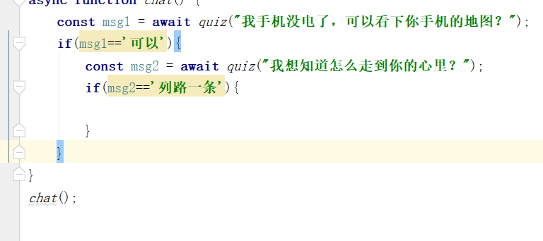

## NODEJS环境
1. nodejs安装
2. 镜像配置 taobao
3. 创建一个项目，打印helloworld
4. `npm init -y`
5. nodejs提示`npm install @types/node -D`

## 模块化开发思想
> 复用代码
> 模块化管理规范 CommandJS AMD
> nodejs中采用的是 CommandJS规范 requires  exports
> 浏览器中采用的是 AMD规范 requirejs实现了规范
    `npm install requirejs`
> Vue中采用ES6规范  webpack babel ES5
  `import export default`

## ES6导入导出
`import exports default`
### export导出
> 可以导出变量、函数、类
###  import导出
> 可以导入变量、函数、类

## 变量
1. 声明时导出变量

## nodejs运行es6 import export
> js文件扩展名使用 .mjs
`node --experimental-modules .\1modules\es6\main.mjs`

### 别名
`as`

### 默认
`default`

## 导入第三方的模块
> 价格一个亿AI程序
需求：
  控制台的输入输出
`npm install readline`

## Promise

## async await

## 文件读写

## 网络爬虫

## web服务器

## 动态网页

## JSON数据接口

## 天气预报

